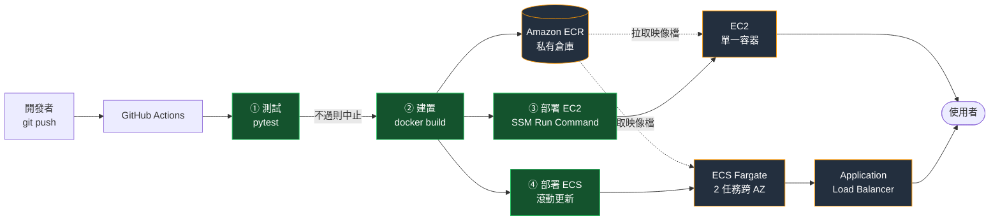

# AWS CI/CD 演化闖關

> 把「改一行程式碼到上線」這件事，從 **18 個步驟、16 分鐘的人工作業**，
> 變成 **1 個步驟、80 秒的全自動流程**——並且每一關都留下可量測的證據。

Tibame NKC202【第 4 期】AWS 雲端工程師 期末專題 · 題目 P3（Tier 3）

---

## 這個專案在回答一個問題

**工程師改了一行程式碼。這行程式碼要怎麼變成線上正在跑的網站？**

這個問題有六種答案，一種比一種好。本專案把六種都做了一遍，並記錄每一種的**步驟數、耗時、失敗次數、是否可追溯**——用數字證明自動化的價值，而不是宣稱。

---

## 線上展示

| 部署目標 | 網址 | 對應關卡 |
|---|---|---|
| EC2（單一容器） | http://52.199.107.190 | 關 3 |
| ECS Fargate（ALB + 2 任務跨 AZ） | http://nkc202-cicd-alb-1176135322.ap-northeast-1.elb.amazonaws.com | 關 4 |

網頁上顯示的 **Git Commit** 可直接對應到本 repo 的 commit——這就是「可追溯性」的具體樣貌。

---

## 成果對照表

| | 人工步驟 | 端到端耗時 | 人工介入 | 失敗次數 | 測試關卡 | 版本可追溯 | 換版中斷 |
|---|---|---|---|---|---|---|---|
| **關 0** 手動部署 | **18 步** | **16 分鐘** | 每次都要 | 2 次 | ❌ | ❌ `none-manual-deploy` | 有 |
| **關 1** 容器化 + ECR | 7 步 | 37 秒 | 每次都要 | 0 次 | ❌ | ✅ 手動帶入 | 有 |
| **關 2** 自動建置 | 1 步 | 56 秒 | 零 | — | ✅ | ✅ 機器產生 | 有 |
| **關 3** 自動部署 EC2 | **1 步** | **80 秒** | **零** | — | ✅ | ✅ 對應 commit | 有 |
| **關 4** ECS 滾動更新 | 1 步 | 約 2 分鐘 | 零 | — | ✅ | ✅ 對應 commit | **無** |
| 關 5 跨雲分發 | — | — | — | — | — | — | 評估後不執行 |

**關 0 → 關 3 改善幅度：人工步驟 −94%、端到端耗時 −92%、人工介入歸零。**

---

## 架構



📐 **完整架構圖、六關演進圖、認證流程時序圖** → [`docs/架構圖.md`](docs/架構圖.md)

---

## 安全設計：全程零長期憑證

這是本專案最值得說明的部分。整條流水線中，**沒有任何一處存放長期金鑰**：

| 環節 | 認證方式 | 有效期 |
|---|---|---|
| GitHub Actions → AWS | **OIDC** 換取臨時憑證 | 1 小時 |
| Actions → ECR | 以臨時憑證換取推送權杖 | 12 小時 |
| Actions → EC2 | SSM Run Command（**不經 SSH**） | 單次 |
| EC2 → ECR | EC2 IAM Role 換取權杖 | 12 小時 |

其他措施：

- **不開 22 port，且主機內 sshd 已停用**——縱深防禦，不依賴單一控制點
- **容器以非 root 使用者執行**，並因此將監聽埠設為 8080 再對外映射 80
- **ECR 私有倉庫 + 推送時漏洞掃描**——實際掃出 CRITICAL 4 / HIGH 8 / MEDIUM 6（來源為基礎映像檔）
- **IAM 權限精確到單一資源**：Actions 角色只能推特定 ECR 倉庫、只能對特定 EC2 下指令、只能更新特定 ECS 服務
- **私有子網使用獨立路由表且無對外路由**——「出不去」由路由層保證，非倚賴防火牆規則
- **基礎設施以 CloudFormation 管理**——整組建立、整組刪除，避免資源殘留

---

## 技術棧

| 分類 | 使用的服務／工具 |
|---|---|
| 運算 | EC2、ECS Fargate |
| 網路 | VPC、Subnet、Internet Gateway、Route Table、Security Group、Application Load Balancer |
| 容器 | Docker、Amazon ECR |
| CI/CD | GitHub Actions、OIDC 身分聯邦 |
| 管理 | Systems Manager（Session Manager、Run Command） |
| IaC | CloudFormation |
| 可觀測性 | CloudWatch Logs、ALB 健康檢查、容器 HEALTHCHECK |
| 成本控制 | AWS Budgets、ECR 生命週期政策 |
| 應用 | Python 3.11、Flask、gunicorn、pytest |

---

## 專案結構

```
.
├── app/                        應用程式
│   ├── app.py                  Flask 應用（首頁顯示版本與 commit）
│   ├── test_app.py             pytest 測試（流水線的守門員）
│   ├── Dockerfile              容器化定義（非 root、層快取最佳化）
│   └── requirements.txt
├── infra/                      基礎設施即程式碼
│   ├── 01-base.yaml            VPC／子網／SG／IAM／EC2
│   └── 02-ecs.yaml             ALB／ECS Cluster／Fargate Service
├── .github/workflows/
│   └── build-and-push.yml      四段式流水線
├── docs/
│   └── 架構圖.md               三張架構圖與設計決策表
├── 證據截圖/                    各關卡的實作證據（26 張）
├── 01_選題說明書.md
├── 關0_手動部署紀錄.md          ← 基準線數據的來源
├── 關1_容器化紀錄.md
├── 關2_自動建置紀錄.md
├── 關3_自動部署紀錄.md
└── 關4_滾動更新紀錄.md
```

---

## 流水線設計

```
git push（唯一的人工動作）
   │
   ├─ ① 執行測試（pytest）
   │     └─ 不通過 → 流水線紅燈中止，不建置、不部署
   │
   ├─ ② 建置並推送映像檔
   │     ├─ 以 OIDC 取得 AWS 臨時憑證
   │     ├─ docker build（版本號由 commit SHA 與流水號自動產生）
   │     └─ 推送三個標籤：<commit-sha> / <version> / latest
   │
   ├─ ③ 部署到 EC2（與 ④ 平行）
   │     └─ SSM Run Command → 拉取映像檔 → 重啟容器
   │
   └─ ④ 滾動更新部署到 ECS（與 ③ 平行）
         └─ 註冊新任務定義 → 新任務健康後才終止舊任務
```

**為什麼推三個標籤：**

| 標籤 | 用途 |
|---|---|
| `<commit-sha>` | 精確對應某次程式碼修改，**回滾時指定這個** |
| `<version>` | 人類可讀的版本號 |
| `latest` | 一般部署預設拉取 |

部署時**刻意指定 commit SHA 而非 `latest`**——`latest` 會被後續建置覆蓋，只有 SHA 能保證「部署的版本」與「程式碼」永久對應。

---

## 兩項關鍵能力的實測

### 測試守門：壞掉的程式碼進不了線上

刻意將測試改壞（預期狀態碼由 200 改為 201）後推送，流水線行為：

```
❌ 執行測試              失敗
⏭️ 建置並推送映像檔       未執行
⏭️ 部署到 EC2            未執行
⏭️ 滾動更新部署到 ECS     未執行
```

| 檢查項目 | 演示前 | 演示後 |
|---|---|---|
| EC2 線上版本 | v1.2.18-ci | **v1.2.18-ci（未變更）** |
| ECS 線上版本 | v1.2.18-ci | **v1.2.18-ci（未變更）** |
| ECR 最新映像檔 | 86adf1a | **86adf1a（未推入新映像檔）** |

**損壞的程式碼連映像檔倉庫都沒進去。** 這在技術上稱為 CI 的品質閘門；以金融業的語言表述，是**自動化的內控關卡**——機器強制執行，操作者無法繞過。

### 回滾：往回 4 個版本，257 秒完成

| 項目 | 內容 |
|---|---|
| 回滾前 | v1.2.20-ci |
| 回滾目標 | `f7f62d4`（v1.2.16-ci） |
| 回滾後 | **EC2 與 ECS 均為 v1.2.16-ci，網頁 Git Commit 顯示 f7f62d4** |
| 耗時 | **257 秒**（含 ECS 滾動更新等待） |

此能力源自「部署指定 commit SHA 而非 `latest`」的設計。`latest` 會被後續建置覆蓋，唯有 SHA 與該次修改永久對應——因此回滾不是特殊程序，只是「指定另一個標籤重新部署」。

---

## 遇到的問題與解法

完整紀錄在各關卡的紀錄檔中，以下列出最值得說明的三個。

### 1. GitHub OIDC 信任政策比對失敗（關 2，卡了 6 次執行）

錯誤訊息只有一句 `Not authorized to perform sts:AssumeRoleWithWebIdentity`，不指出哪個條件不符。

**三次推測全部錯誤**（IAM 傳播延遲、憑證指紋過期、大小寫不符），共耗費約 10 分鐘。
最後在流水線中加入除錯步驟，印出 GitHub 實際送出的權杖內容：

```
sub = repo:CarlosChangYao@39613248/aws-cicd-pipeline@1334878950:ref:refs/heads/main
```

而信任政策設定的是網路教學上常見的舊格式 `repo:OWNER/REPO:*`。
**GitHub 已改用「不可變主體識別」格式**，在 `sub` 中嵌入帳號與 repo 的數字 ID。

> 改用數字 ID 反而更安全：名稱可改，ID 不會變。

**啟示：** 錯誤訊息資訊量不足時，唯一有效的方法是把雙方實際的值印出來直接比對，而非依經驗猜測。

### 2. 跨架構建置（關 1）

開發機為 Apple Silicon（arm64），EC2 為 x86_64。直接建置的映像檔在 EC2 上會出現 `exec format error`。
解法為建置時指定 `--platform linux/amd64`。

### 3. ECR 漏洞掃描沒有結果（關 1）

`scanOnPush=true` 已設定，但查詢掃描結果回報 `ScanNotFoundException`。
根因為 buildx 搭配 `--platform` 預設產出 **OCI Image Index**（映像檔索引），而 ECR 基本掃描僅支援單一映像檔 manifest。
解法為建置時加上 `--provenance=false --sbom=false`。

---

## 如何重現

```bash
# 1. 建立基礎環境（VPC、EC2、IAM）
aws cloudformation create-stack \
  --stack-name nkc202-cicd-base \
  --template-body file://infra/01-base.yaml \
  --capabilities CAPABILITY_NAMED_IAM

# 2. 建立 ECS 環境（ALB、Fargate）
aws cloudformation create-stack \
  --stack-name nkc202-cicd-ecs \
  --template-body file://infra/02-ecs.yaml \
  --capabilities CAPABILITY_NAMED_IAM

# 3. 清除所有資源
aws cloudformation delete-stack --stack-name nkc202-cicd-ecs
aws cloudformation delete-stack --stack-name nkc202-cicd-base
```

> OIDC 提供者與 GitHub Actions 角色需另外建立，設定內容見 [`關2_自動建置紀錄.md`](關2_自動建置紀錄.md)。

---

## 這個專案解決的是什麼問題

技術以外，本專案的核心論述是：**在金融業，「系統上線」不是技術問題，是風險與法遵問題。**

| 手動部署的風險 | 內控術語 | 本專案的解法 |
|---|---|---|
| 18 個步驟仰賴人不出錯 | 作業風險 | 自動化，人只做 1 步 |
| 不知道線上是哪一版 | 稽核軌跡 / 可追溯性 | 每次部署綁定 commit SHA |
| 出錯後復原耗時 | 營運持續（BCP） | 指定舊版 SHA 重新部署即可回滾 |
| 上線需人工登入主機 | 存取控制 / 特權帳號管理 | 全程無 SSH，改由 SSM 執行並留下 CloudTrail 紀錄 |
| 沒有審批與檢查紀錄 | 變更管理 / 內控三道防線 | 測試不過流水線紅燈中止，繞不過去 |
| 換版需停機窗口 | 服務中斷 | ECS 滾動更新，換版不中斷 |
