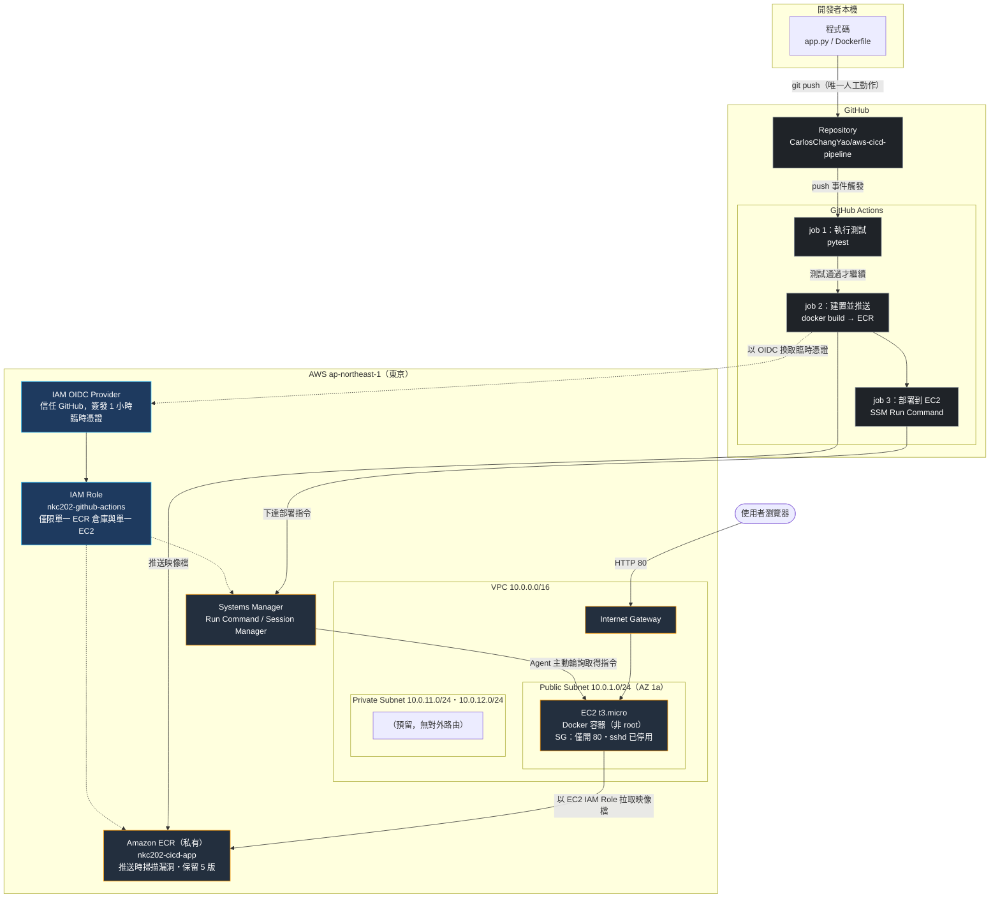
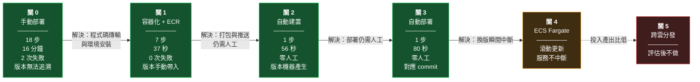
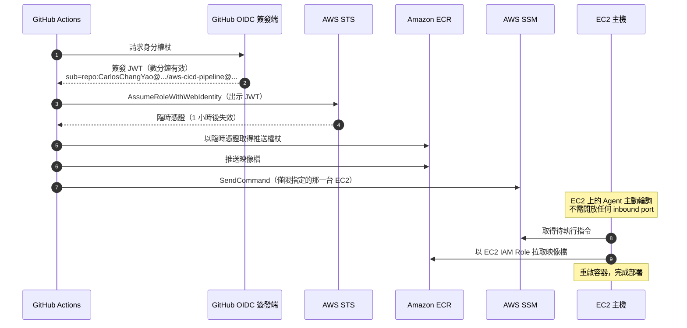

# 系統架構圖

> 本檔案的圖以 Mermaid 撰寫，GitHub 會自動渲染。
> 修改圖形只需改文字，不需重新繪製與上傳圖檔——這本身也是「基礎設施即程式碼」思維的延伸。

---

## 圖一：完整架構（關 3 完成後的狀態）

---

## 圖二：六關演進（本專題的主軸）

---

## 圖三：認證流程（全程零長期金鑰）

> 這張圖回答的是：**「GitHub 憑什麼能操作你的 AWS？金鑰放在哪裡？」**
> 答案是：**沒有金鑰。** 每一段都是「用身分換取短期憑證」。

---

## 關鍵設計決策

| 決策 | 選擇 | 理由 | 代價 |
|---|---|---|---|
| **不建 NAT Gateway** | 私有子網無對外路由 | 私有子網目前無主動對外需求 | 省 US$32/月，且少一個攻擊面 |
| **私有子網用獨立路由表** | 路由表僅有 `local` | 「出不去」由路由層保證，不倚賴防火牆規則 | 無 |
| **不開 22 port 且停用 sshd** | 管理走 SSM | 縱深防禦：即使 SG 被誤改，主機也無 SSH 服務 | 無 |
| **OIDC 而非 Access Key** | 臨時憑證 | repo 內零長期金鑰，外洩風險大幅降低 | 設定較複雜（本專題卡了 6 次執行） |
| **部署指定 commit SHA** | 不使用 `latest` | `latest` 會被覆蓋，指定 SHA 才能精準對應與回滾 | 無 |
| **容器以非 root 執行** | 建立 `appuser` | 容器遭入侵時攻擊者非 root | 需將監聽埠改為 8080 並對外映射 |
| **ECR 生命週期政策** | 僅保留 5 版 | 避免映像檔無限累積產生儲存費 | 過舊版本無法回滾 |
| **CloudFormation 管理基礎設施** | IaC | 整組建立／整組刪除，避免資源殘留 | 學習成本 |
